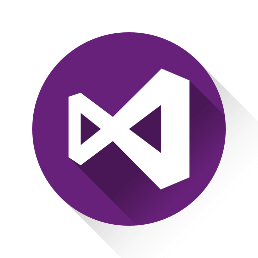

# Theme Visual Studio

 
 
 
   
  
  
  
   
   
   <i>"acode-theme-vscode is a bot for discord, simple and easy to use, you think of a bot, you think of Mee6, don't you? Kelly too!"</i>
  
   - It has several languages
   - Easy to understand code 
   - private ticket
   - Music commands working 

